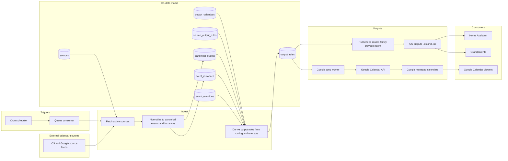
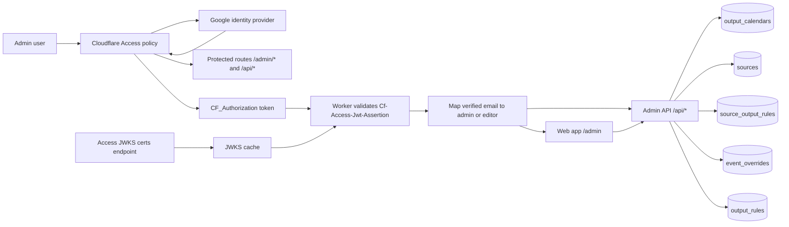

# System Workflow Diagram

## Core Pipeline

## Admin Auth Flow

## Admin Flow

1. Create output calendars (`naomi`, `grayson`, `family`, plus managed Google outputs as needed).
2. Add source calendars (ICS or Google).
3. Connect each source to one or more outputs using `source_output_rules` with per-relationship rules (`prefix`, `icon`, `is_enabled`, and optional rendering controls).

## Routing Model

| Table | Responsibility |
|---|---|
| `sources` | One row per upstream feed/calendar |
| `output_calendars` | One row per output surface |
| `source_output_rules` | Many-to-many join + per-relationship rendering/routing rules |

## Decoration Rules

| Output | Icon | Child prefix (e.g. `N:`) |
|---|---|---|
| `naomi.ics` | ✅ | ❌ |
| `grayson.ics` | ✅ | ❌ |
| `family.ics` | ✅ | ✅ |
| Google output calendars | per-output rule | per-output rule |

Icon precedence:

1. explicit icon on `source_output_rules`
2. explicit icon on `sources`
3. fallback sport detection regex on event summary/title (legacy parity behavior for feeds like school calendars without dedicated ICS streams)

## Auth Boundary

| Surface | Auth |
|---|---|
| Public ICS feeds (`.ics` + `.isc`) | `?token=` required; supports `?lookback=` and `?name=` |
| Admin API + Web App (`/api/*`, `/admin/*`) | Cloudflare Access challenge + Google login + Worker JWT validation + role mapping |
| Access JWT verification | Validate `Cf-Access-Jwt-Assertion` using Access JWKS with cache + refresh on `kid` miss |
| Local dev | `ALLOW_DEV_ROLE_HEADER=true` |

## Status Notes

- Google outbound sync path is shown as target architecture; full production write-sync implementation is still tracked as open work.
- Cron plus queue nodes are intentionally distinct because retention/pruning and retry behavior run through queue execution.
