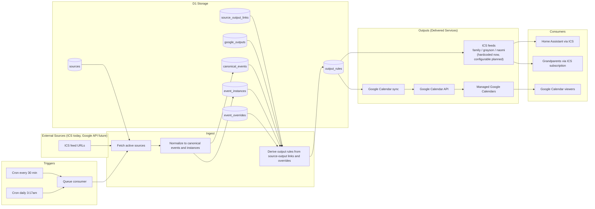

# System Workflow

_Updated: 2026-03-06_

## Concepts

| Term | Meaning |
|---|---|
| **Source** | An upstream calendar feed this system ingests. Currently ICS URLs only. Google Calendar API ingestion is deferred. |
| **Output** | A delivered calendar service. Either a named ICS feed or a managed Google Calendar. |
| **Source → Output link** | The assignment of a source to an output. Carries per-link rendering rules (icon, prefix). Designed as a join table so rules can be extended (e.g. filters) without schema changes. |
| **Override** | An admin-applied change to how a specific event or instance is handled — for example, removing a recurring practice from the calendar because the family cannot attend that week. |

---

## Core Pipeline



---

## Output Types

| Output type | How it works | Status |
|---|---|---|
| ICS feed | Generated on-demand from `output_rules` when a consumer requests the URL | Live |
| Google Calendar | Written to via Google Calendar API on each sync cycle | Not yet implemented |

### ICS Output Configuration (Planned)

The three ICS feeds (`family`, `grayson`, `naomi`) are currently hardcoded in the route matcher and constants. The intended direction is to make these configurable rows in the same output table as Google outputs, so any named ICS feed can be created or retired without a code change.

---

## Source → Output Links

Each source can be assigned to one or more outputs. Each assignment is a row in `source_target_links` (to be renamed `source_output_links`) and carries:

| Rule field | Purpose |
|---|---|
| `icon` | Emoji prepended to the event summary on this output |
| `prefix` | Short label prepended before the icon (e.g. `G:` or `N:`) — primarily used on the combined `family` feed |
| `sort_order` | Display ordering within the output |

The join table design means additional rule fields (e.g. keyword filters, time-of-day filters) can be added as columns without restructuring the relationship.

---

## Decoration Rules by Output

| Output | Prefix applied | Icon applied |
|---|---|---|
| `family.ics` | ✅ (e.g. `G:`, `N:`) | ✅ |
| `grayson.ics` | ❌ | ✅ |
| `naomi.ics` | ❌ | ✅ |
| Google output | per-link rule | per-link rule |

Icon resolution order:
1. Explicit icon on the source → output link
2. Explicit icon on the source
3. Fallback sport detection from event title (legacy parity for feeds without dedicated icons)

---

## Overrides

An override is an admin-applied instruction that changes how an event or event instance is treated in the system.

Examples:
- **Skip** — remove a specific instance of a recurring event from all outputs (e.g. "we can't make practice this Thursday")
- **Hidden** — suppress an event from a specific output
- **Maybe** — flag an event as uncertain
- **Note** — attach context to an event without changing its distribution

Overrides are stored in `event_overrides` and applied during the `DERIVE` step before `output_rules` are written.

---

## Admin Auth Flow

```mermaid
flowchart LR
    USER[Admin] --> ACCESS[Cloudflare Access]
    ACCESS --> GOOGLE[Google sign-in]
    GOOGLE --> ACCESS
    ACCESS --> JWT[Cf-Access-Jwt-Assertion header]
    JWT --> WORKER[Worker validates JWT against Access JWKS]
    WORKER --> ROLE[Map verified email to admin or editor role]
    ROLE --> ADMIN[/admin shell]
    ROLE --> API[/api/* routes]
```

---

## Auth Boundary

| Surface | Protection |
|---|---|
| Public ICS feeds (`.ics`, `.isc`) | `?token=` query parameter |
| Admin shell `/admin` | Cloudflare Access (network layer) |
| Admin API `/api/*` | Cloudflare Access + Worker JWT validation + role check |
| Local dev | `ALLOW_DEV_ROLE_HEADER=true` + `x-user-role` header |

---

## Status Notes

- Google outbound sync is modeled in the pipeline but not yet implemented.
- ICS output configuration is hardcoded today; moving to DB-driven configuration is the intended direction.
- Google Calendar API ingestion (as a source) is explicitly deferred in favour of ICS URLs from Google Calendar, which are simpler and avoid a second OAuth scope.
